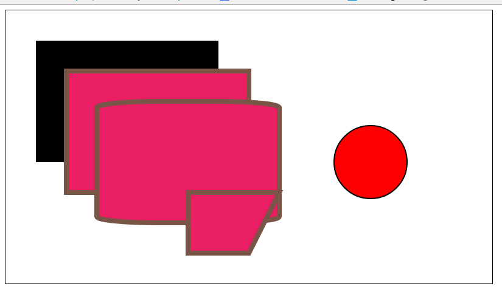

# SVG


* rect
* polygon
* circle
* text
* path

官方网站： https://developer.mozilla.org/zh-CN/docs/Web/SVG/Tutorial/Paths


## 普通图形

* 效果



* 代码

```html
  <!DOCTYPE html>
  <html lang="en">
  <head>
    <meta charset="UTF-8">
    <title>D3 and the DOM</title>
  </head>
  <body>
  <style>
    svg{
      border: 1px solid black;
      width: 800px;
      height: 450px;
    }
  </style>
  <svg version="1.1" baseProfile="full" xmlns="http://www.w3.org/2000/svg">
    <rect x="50" y="50" width="300" height="200" />
    <rect x="100"  y="100" width="300" height="200" fill="#e91e63" stroke="#795548" stroke-width="8px"/>
    <rect x="150"  y="150" ry="10px" rx="100px" width="300" height="200" fill="#e91e63" stroke="#795548" stroke-width="8px"/>

    <polygon points="300,300 300,400 400,400 450,300"  fill="#e91e63" stroke="#795548" stroke-width="8px"/>

    <circle cx="600" cy="250" r="60" fill="red" stroke-width="2px" stroke="black"></circle>

    <text x="400" y="430" dx="-20">这是文字</text>

    <text x="400" y="400" text-anchor="middle" font-size="2rem" font-family="sans-serif" fill="#00ff00"
      transform="rotate(-30,40,430)">好的人是好人</text>
  </svg>
  </body>
  </html>
```


## path 线

path 可以画任何的图形

* d 属性

    * M（move）命令
    * L（line）
    * Z（close path）

    * Q（quadratic bezier curve）
    * c(cubick bezier curve)
    * A(circular arc)


* MX Y
    * 移动鼠标到X,Y

* LX Y
    * 从鼠标当前的位置，画一个线
* lX Y
    * 从鼠标当前位置，向X Y方向长度画线

* Z/z 命令

* H/h 画水平线

* V/v 画垂直线


```html
  <!DOCTYPE html>
  <html lang="en">
  <head>
    <meta charset="UTF-8">
    <title>D3 and the DOM</title>
  </head>
  <body>
  <style>
    svg{
      border: 1px solid black;
      width: 800px;
      height: 450px;
    }
  </style>
  <svg version="1.1" baseProfile="full" xmlns="http://www.w3.org/2000/svg">
    <path d="M400 100
            L500 300
            L300 300
            L400 100"
          stroke="purple" stroke-width="3px"/>
    <path d="M600 300
            l100 0
            l0 100
            l-100 -100"
          stroke="purple" stroke-width="3px"/>
    <path d="M150 300
            h100
            v100
            h-120
            z"
          stroke="purple" stroke-width="3px"/>
  </svg>
  </body>
  </html>
```


## d curve 命令


* Q (quadratic bezier curve,平方贝尔曲线)
    * Q cx cy x y       (cx,cy)控制点，(x,y)目标点
* C(cubick bezier curve，立方贝尔曲线)
    * C cx1 cy1,cx2 cy2,x y  (cx1,cy1)控制点1 ,(cx2,cy2)控制点2,(x,x)目标点
* A(circular arc)
    * A rx ry rotate largeArc sweep x y
    * rx - x radius
    * ry - y radius
    * xy - distination


* 例子1

```html 
<!DOCTYPE html>
<html lang="en">
<head>
    <meta charset="UTF-8">
    <title>D3 and the DOM</title>
</head>
<body>
<style>
    svg {
        border: 1px solid black;
        width: 800px;
        height: 450px;
    }
</style>
<svg version="1.1" baseProfile="full" xmlns="http://www.w3.org/2000/svg">
    <g fill="none" stroke-width="10px">
        <path d="M0 225 C200 450 400 0 800 225" stroke="purple" />
        <path d="M100 100 Q700 200 700 350" stroke="blue" />
    </g>
</svg>
</body>
</html>
```

```html
<!DOCTYPE html>
<html lang="en">
<head>
    <meta charset="UTF-8">
    <title>D3 and the DOM</title>
</head>
<body>
<style>
    svg {
        border: 1px solid black;
        width: 800px;
        height: 450px;
    }
</style>
<svg version="1.1" baseProfile="full" xmlns="http://www.w3.org/2000/svg">
    <path d="M300 250 A100 100 0 0 0 480 300" fill="green"/>
    <circle cx="300" cy="250" r="5"></circle>
    <circle cx="480" cy="300" r="5" />
</svg>
</body>
</html>
```