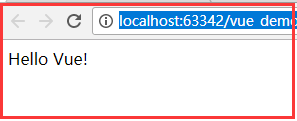

# 入门

## 引入vue

创建``xxx.html``文件，在``<head>``与``</head>``之间插入：
```
<script src="https://unpkg.com/vue"></script>
```
注：如果是生产版本，请引入``https://vuejs.org/js/vue.min.js``

## 申明渲染

采用简介的模板语法将数据渲染引进DOM
```
<div id="app">
  {{ message }}
</div>
```

```
var app = new Vue({
  el: '#app',
  data: {
    message: 'Hello Vue!'
  }
})
```

显示效果如：




## 完整代码
```
<!DOCTYPE html>
<html lang="en">
<head>
    <meta charset="UTF-8">
    <title>Title</title>
    <script src="https://unpkg.com/vue"></script>
</head>
<body>
<div id="app">
    {{ message }}
</div>
<script>
    var app = new Vue({
        el: '#app',
        data: {
            message: 'Hello Vue!'
        }
    })
</script>
</body>
</html>
```
