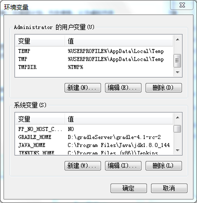
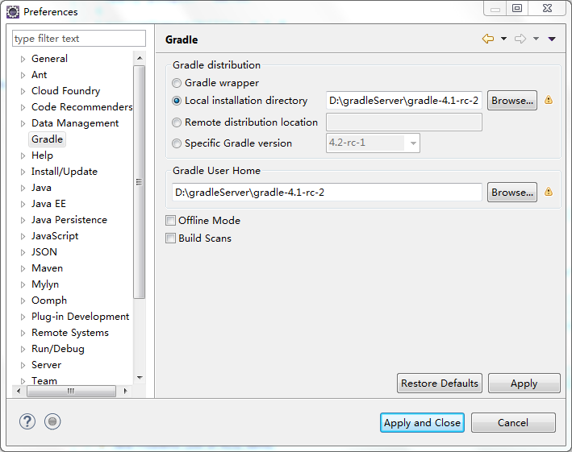
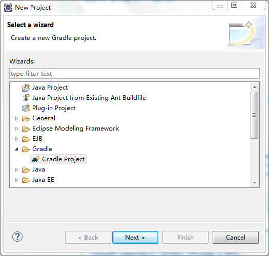
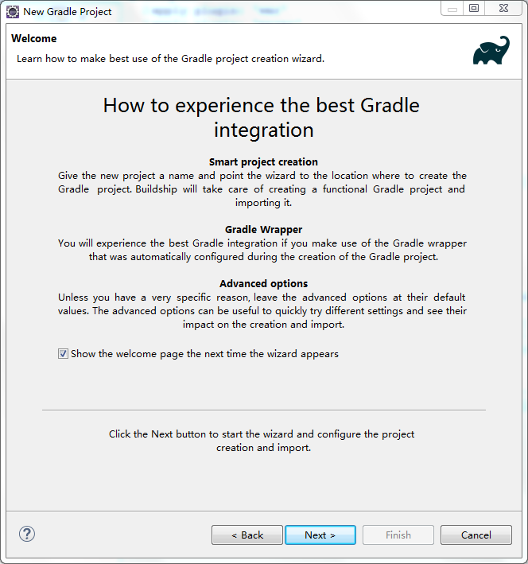
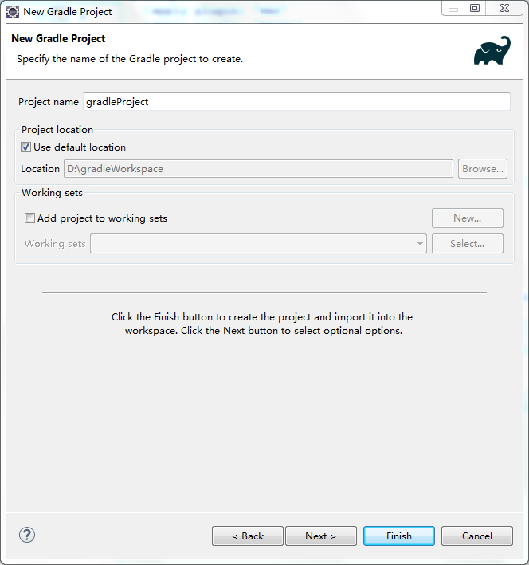
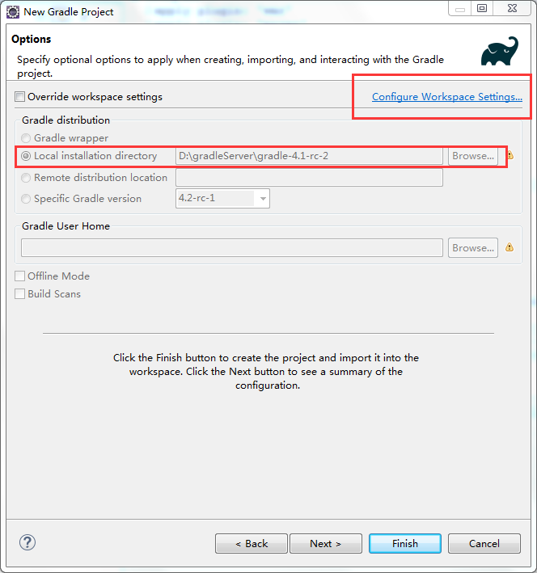
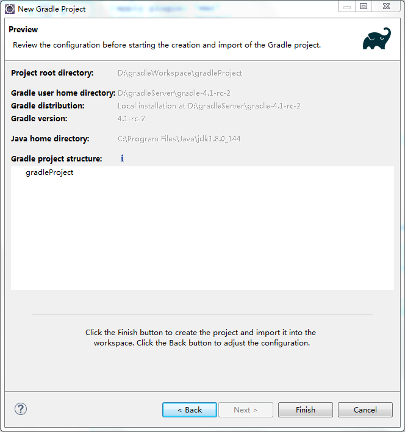
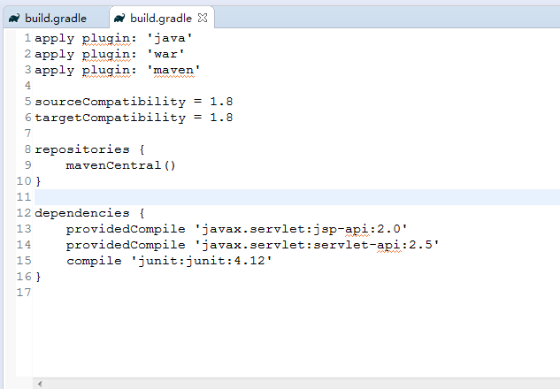
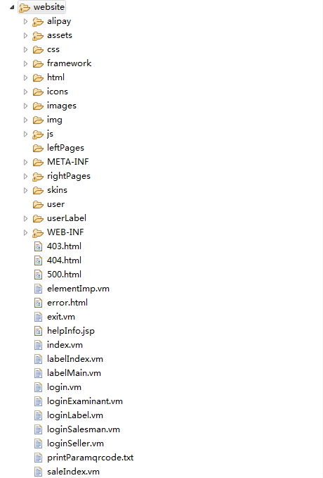

# 转换GRADLE项目 {ignore=ture}

<!-- @import "[TOC]" {cmd="toc" depthFrom=1 depthTo=6 orderedList=false} -->
<!-- code_chunk_output -->

* [前言](#前言)
* [软件环境](#软件环境)
* [环境及工具配置](#环境及工具配置)
	* [配置eclipse](#配置eclipse)
	* [配置gradle](#配置gradle)
* [创建gradle项目](#创建gradle项目)
	* [创建](#创建)
	* [项目参数配置](#项目参数配置)
* [java项目转gradle项目](#java项目转gradle项目)

<!-- /code_chunk_output -->


## 前言

在Java构建工具的世界里，先有了Ant，然后有了Maven。Maven的CoC[1]、依赖管理以及项目构建规则重用性等特点，让Maven几乎成为Java构建工具的事实标准。然而，冗余的依赖管理配置、复杂并且难以扩展的构建生命周期，都成为使用Maven的困扰。

Gradle作为新的构建工具，获得了2010 Springy大奖，并入围了2011的Jax最佳Java技术发明奖。它是基于Groovy语言的构建工具，既保持了Maven的优点，又通过使用Groovy定义的DSL[2]，克服了 Maven中使用XML繁冗以及不灵活等缺点。在Eugene Dvorkin撰写的文章《最让人激动的5个Java项目》中，他是这样介绍Gradle的：“工程自动化是软件项目成功的必要条件，而且它应该实现起来简单、易用、好玩。构建没有千篇一律的方法，所以Gradle没有死板的强加方法于我们，尽管你会认为查找和描述方法很重要，然而Gradle对于如何描述有着非常好的支持。我不认为工具能够拯救我们，但是Gradle能给你所需要的自由，你可以利用Gradle构建易描述的、可维护的、简洁的、高性能项目”。 

Gradle作为构建脚本的大型Java项目上工作，更深切体会到Gradle在项目构建过程中是如此的简单、易用。

## 软件环境

```
   eclipse oxygen
   gradle-4.1-rc-2
   tomcat 8.5
   win 10
   java 1.8
```
gradle-4.1-rc-2 解压即可，环境已经搭建好。

## 环境及工具配置

### 配置eclipse
* 官网下载 eclipse 包，解压即可

* 运行 eclipse  


* eclipse安装gradle插件

在Eclipse中，点击Help菜单，然后有个Eclipse Marketplace,搜索buildship，然后出现如下，install第一个，然后重启Eclipse


### 配置gradle
* gradle配置

    1、作者的gradle工具解压目录在D:\gradleServer\gradle-4.1-rc-2

    2、系统环境配置新增GRADLE_HOME，和新增PATH路径中添加 "%GRADLE_HOME%\bin


    3、eclipse 配置 gradle



## 创建gradle项目

### 创建

* 打开eclipse，new project 选择 gradle project


* 下一步


* 填写 项目名称


* 下一步


* 完成



### 项目参数配置

* build.gradle

    apply plugin: 'java' // java 应用程序

    apply plugin: 'war' //war包

    sourceCompatibility = 1.8   //源jdk版本

    targetCompatibility = 1.8   //目标jdk版本

    mavenCentral //中央仓库

    compile //引用jar包


* 编译打包 cmd 到项目目录下，运行 gradle build


### java项目转gradle项目

* 创建项目同名的gradle项目例如：URPCSF0008.3


* build.gradle 配置
```
apply plugin: 'java'
apply plugin: 'war'
apply plugin: 'maven'

sourceCompatibility = 1.8
targetCompatibility = 1.8
//version = '1.0.1-SNAPSHOP'

webAppDirName = 'website'

tasks.withType(JavaCompile) {  
    options.encoding = 'UTF-8'  
}

repositories {
	mavenCentral()
}

dependencies { 
    providedCompile 'javax.servlet:jsp-api:2.0'
	providedCompile 'javax.servlet:servlet-api:2.5'
	compile fileTree(dir: 'website/WEB-INF/lib', include: '*.jar')
}
```
配置根据项目的需要引入需要的jar包。


* 代码

原项目的代码复制到 src/main/java 中


* 配置文件

原项目的配置文件复制到 src/main/resources 中


* 根目录

指定根目录文件夹website



* Project Facets


* 编译打包 cmd 到项目目录下，运行 gradle build


[返回](readme.md)