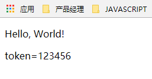

# 配置文件 {ignore=true}


<!-- @import "[TOC]" {cmd="toc" depthFrom=1 depthTo=6 orderedList=false} -->
<!-- code_chunk_output -->

* [简要说明](#简要说明)
* [使用application.properties文件](#使用applicationproperties文件)
* [自定义文件](#自定义文件)

<!-- /code_chunk_output -->


## 简要说明

本文介绍在spring boot中如何使用配置文件，使用配置文件时，可以直接使用application.properties文件，也可以自定义配置文件，下文将一一介绍。

## 使用application.properties文件

* 创建spring web server项目，可参考： http://58.250.204.146:6002/fangle/wxtag/blob/master/docs/project_assets/spring_web_server.md

* 创建../src/main/resources/application.properties文件，添加properties代码   
	```
	server.port=80 
	wechat.token=123456  
	```

* 定义配置类/src/main/java/hello/WechatSettings.java
	```java
	package hello;

	import org.springframework.boot.context.properties.ConfigurationProperties;

	@ConfigurationProperties(prefix = "wechat") 
	public class WechatSettings {
		private String token;

		/**
		* @return the token
		*/
		public String getToken() {
			return token;
		}

		/**
		* @param token the token to set
		*/
		public void setToken(String token) {
			this.token = token;
		} 
		

	}
	```

* 入口类添加 @EnableConfigurationProperties
	```java
	package hello;

	import org.springframework.boot.SpringApplication;
	import org.springframework.boot.autoconfigure.SpringBootApplication;
	import org.springframework.boot.context.properties.EnableConfigurationProperties;

	@SpringBootApplication
	@EnableConfigurationProperties({WechatSettings.class})  
	public class Application {

		public static void main(String[] args) {
			SpringApplication.run(Application.class, args);
		}

	}
	```

* 使用定义的properties，在控制类中注入bean   
	```java
	package hello;

	import org.springframework.beans.factory.annotation.Autowired;
	import org.springframework.stereotype.Controller;
	import org.springframework.ui.Model;
	import org.springframework.web.bind.annotation.RequestMapping;
	import org.springframework.web.bind.annotation.RequestParam;

	@Controller
	public class GreetingController {

		@Autowired
		WechatSettings wechatSettings;

		@RequestMapping("/greeting")
		public String greeting(@RequestParam(value = "name", required = false, defaultValue = "World") String name,
				Model model) {
			model.addAttribute("name", name);
			model.addAttribute("token",wechatSettings.getToken());
			return "greeting";
		}

	}
	```

* 前端显示出数据出来greeting.html
	```html
	<!DOCTYPE HTML>
	<html xmlns:th="http://www.thymeleaf.org">
	<head>
		<title>Getting Started: Serving Web Content</title>
		<meta http-equiv="Content-Type" content="text/html; charset=UTF-8" />
	</head>
	<body>
		<p th:text="'Hello, ' + ${name} + '!'" />
		<p th:text="'token=' + ${token}" />
	</body>
	</html>
	```

* 运行效果如下  
      


## 自定义文件

自定义文件，配置文件将会不同，其他内容一致:
* 自定义文件：
	```java
	@ConfigurationProperties(prefix = "wisely",locations = "classpath:config/wechat.properties")  
	public class WechatSettings 
	```
* 使用application.properties
	```java
	@ConfigurationProperties(prefix = "wechat") 
	public class WechatSettings
	```

