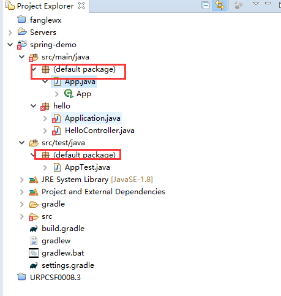
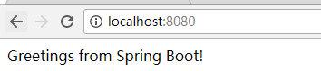
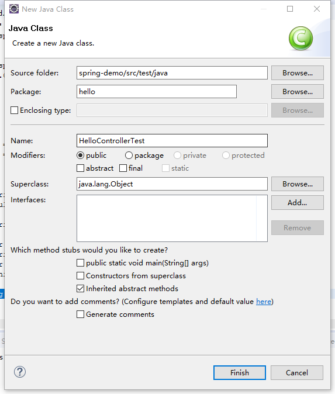

# 第一个spring项目 {ignore=true}


<!-- @import "[TOC]" {cmd="toc" depthFrom=1 depthTo=6 orderedList=false} -->
<!-- code_chunk_output -->

* [简介](#简介)
* [开发环境](#开发环境)
* [添加工程程序](#添加工程程序)
* [添加单元测试程序](#添加单元测试程序)
* [检查系统是否正常](#检查系统是否正常)
* [生成war包](#生成war包)
* [补充说明](#补充说明)

<!-- /code_chunk_output -->


## 简介

通过跟随本教程，读者会建立第一个spring项目，并通过网页返回一个字符串。

## 开发环境

* jdk 1.8
* git 
* gradle 
* eclipse

## 添加工程程序

* 创建gradle项目
    ```
    Administrator@WIN-KH7USRS3HHQ MINGW64 /e
    $ mkdir spring-demo

    Administrator@WIN-KH7USRS3HHQ MINGW64 /e
    $ cd spring-demo/

    Administrator@WIN-KH7USRS3HHQ MINGW64 /e/spring-demo
    $ gradle init --type java-application

    Starting a Gradle Daemon (subsequent builds will be faster)
    :wrapper
    :init

    BUILD SUCCESSFUL in 8s
    2 actionable tasks: 2 executed
    ```

* 导入gradle 项目到eclipse,如果不知道如何操作，请查看[【导入gradle项目到eclipse】](import_gradle_proj.md)


* 修改``build.gradle``

    ```java
    buildscript {
        repositories {
            mavenCentral()
        }
        dependencies {
            classpath("org.springframework.boot:spring-boot-gradle-plugin:1.5.7.RELEASE")
        }
    }

    apply plugin: 'java'
    apply plugin: 'eclipse'
    apply plugin: 'idea'
    apply plugin: 'org.springframework.boot'

    jar {
        baseName = 'gs-spring-boot'
        version =  '0.1.0'
    }

    repositories {
        mavenCentral()
    }

    sourceCompatibility = 1.8
    targetCompatibility = 1.8

    dependencies {
        // tag::jetty[]
        compile("org.springframework.boot:spring-boot-starter-web") {
            exclude module: "spring-boot-starter-tomcat"
        }
        compile("org.springframework.boot:spring-boot-starter-jetty")
        // end::jetty[]
        // tag::actuator[]
        compile("org.springframework.boot:spring-boot-starter-actuator")
        // end::actuator[]
        testCompile("junit:junit")
    }
    ```

* 新建hello包  
    

* 创建control类
    ```java
    package hello;

    import org.springframework.web.bind.annotation.RestController;
    import org.springframework.web.bind.annotation.RequestMapping;

    @RestController
    public class HelloController {

        @RequestMapping("/")
        public String index() {
            return "Greetings from Spring Boot!";
        }

    }
    ```

* 创建应用入口类
    ```java
    package hello;

    import java.util.Arrays;

    import org.springframework.boot.CommandLineRunner;
    import org.springframework.boot.SpringApplication;
    import org.springframework.boot.autoconfigure.SpringBootApplication;
    import org.springframework.context.ApplicationContext;
    import org.springframework.context.annotation.Bean;

    @SpringBootApplication
    public class Application {

        public static void main(String[] args) {
            SpringApplication.run(Application.class, args);
        }

        @Bean
        public CommandLineRunner commandLineRunner(ApplicationContext ctx) {
            return args -> {

                System.out.println("Let's inspect the beans provided by Spring Boot:");

                String[] beanNames = ctx.getBeanDefinitionNames();
                Arrays.sort(beanNames);
                for (String beanName : beanNames) {
                    System.out.println(beanName);
                }

            };
        }

    }
    ```

* 删除掉default package以及内部的类  
    

* 点击项目->右键->gradle->refresh,等待gradle把依赖文件自动下载完毕

* 启动项目
    ```
    ./gradlew build && java -jar build/libs/gs-spring-boot-0.1.0.jar
    ```
* 浏览器访问服务器  
    


## 添加单元测试程序

* build.gradle中添加依赖
    ```
    testCompile("org.springframework.boot:spring-boot-starter-test")
    ```
* 添加单元测试代码，HelloControllerTest，eclipse里刷新gradle项目  
    
    ```java
    package hello;

    import static org.hamcrest.Matchers.equalTo;
    import static org.springframework.test.web.servlet.result.MockMvcResultMatchers.content;
    import static org.springframework.test.web.servlet.result.MockMvcResultMatchers.status;

    import org.junit.Test;
    import org.junit.runner.RunWith;
    import org.springframework.beans.factory.annotation.Autowired;
    import org.springframework.boot.test.autoconfigure.web.servlet.AutoConfigureMockMvc;
    import org.springframework.boot.test.context.SpringBootTest;
    import org.springframework.http.MediaType;
    import org.springframework.test.context.junit4.SpringRunner;
    import org.springframework.test.web.servlet.MockMvc;
    import org.springframework.test.web.servlet.request.MockMvcRequestBuilders;

    @RunWith(SpringRunner.class)
    @SpringBootTest
    @AutoConfigureMockMvc
    public class HelloControllerTest {

        @Autowired
        private MockMvc mvc;

        @Test
        public void getHello() throws Exception {
            mvc.perform(MockMvcRequestBuilders.get("/").accept(MediaType.APPLICATION_JSON))
                    .andExpect(status().isOk())
                    .andExpect(content().string(equalTo("Greetings from Spring Boot!")));
        }
    }
    ```

* 再新建一个单元测试,HelloControllerIT.java
    ```java
    package hello;

    import static org.hamcrest.Matchers.equalTo;
    import static org.junit.Assert.assertThat;

    import java.net.URL;

    import org.junit.Before;
    import org.junit.Test;
    import org.junit.runner.RunWith;
    import org.springframework.beans.factory.annotation.Autowired;
    import org.springframework.boot.context.embedded.LocalServerPort;
    import org.springframework.boot.test.context.SpringBootTest;
    import org.springframework.boot.test.web.client.TestRestTemplate;
    import org.springframework.http.ResponseEntity;
    import org.springframework.test.context.junit4.SpringRunner;

    @RunWith(SpringRunner.class)
    @SpringBootTest(webEnvironment = SpringBootTest.WebEnvironment.RANDOM_PORT)
    public class HelloControllerIT {

        @LocalServerPort
        private int port;

        private URL base;

        @Autowired
        private TestRestTemplate template;

        @Before
        public void setUp() throws Exception {
            this.base = new URL("http://localhost:" + port + "/");
        }

        @Test
        public void getHello() throws Exception {
            ResponseEntity<String> response = template.getForEntity(base.toString(),
                    String.class);
            assertThat(response.getBody(), equalTo("Greetings from Spring Boot!"));
        }
    }
    ```

* 执行test命令

```
E:\spring-demo>gradlew test

BUILD SUCCESSFUL in 1s
3 actionable tasks: 3 up-to-date
```

## 检查系统是否正常

可以入下用指令访问服务器，也可以用网页直接访问
```
$ curl localhost:8080/health
{"status":"UP","diskSpace":{"status":"UP","total":397635555328,"free":328389529600,"threshold":10485760}}}
```

## 生成war包

* 在build.gradle前面添加插件``apply plugin: 'war'``
* 在build.gradle的dependencies里面加入``providedRuntime("org.springframework.boot:spring-boot-starter-tomcat")``
* 刷新gradle工程，编译``./gradlew build``

## 补充说明

* 后续文档将不会对gradle项目的建立和导入做说明。
* 注解

| 注解名称        | 作用 | 例如                                                     |
|-----------------|------|----------------------------------------------------------|
| @RestController | restful控制器声明     | @RestController<br>public class HelloController {<br>... |
|@RequestMapping("/")|url到控制器方法映射|@RequestMapping("/")<br>public String index() {|
|@SpringBootApplication|申明spring boot应用|@SpringBootApplication<br>public class Application {|
