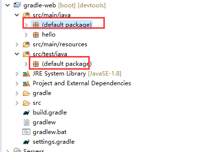
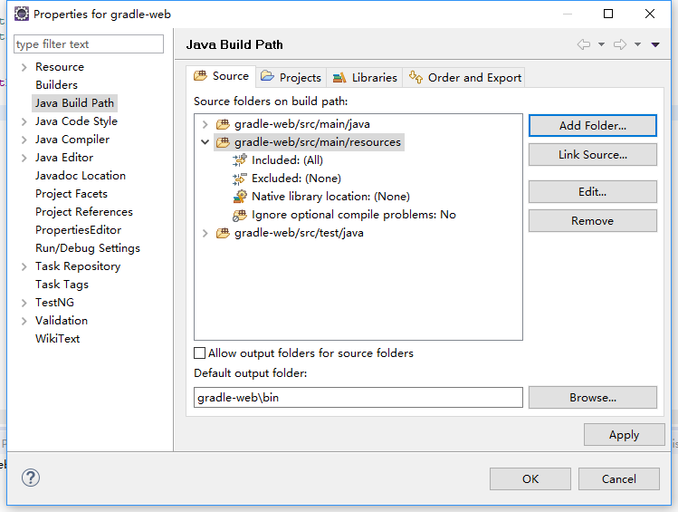
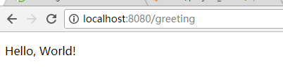
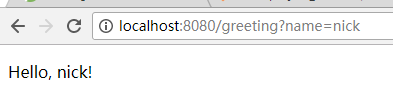
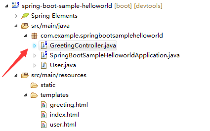
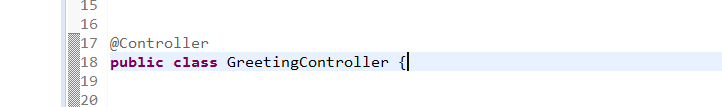

# 实现spring web server {ignore=true}


<!-- @import "[TOC]" {cmd="toc" depthFrom=1 depthTo=6 orderedList=false} -->
<!-- code_chunk_output -->

* [简介](#简介)
* [开发环境](#开发环境)
* [操作步骤](#操作步骤)
* [总结](#总结)
	* [使用的注解](#使用的注解)
    * [引入Vue](#引入vue)
	* [Thymeleaf引擎](#thymeleaf引擎)
	* [打包成war包](#打包成war包http582502041466002fanglewxtagblobmasterdocsproject_assetsspring_for_tomcatmd)
	* [启动工程](#启动工程)
    * [代码示例](#代码示例)
	
	

<!-- /code_chunk_output -->


## 简介
文章实现了spring与前端交互 ，读者能够学习spring通过Thymeleaf渲染发送给浏览器，Vue.js获取后端数据在浏览器上动态渲染页面

## 开发环境

* jdk 1.8
* gradle 
* eclipse


## 操作步骤

* 新建gradle项目  
    ```
    $ mkdir gradle-web

    Administrator@WIN-KH7USRS3HHQ MINGW64 /e
    $ cd gradle-web/

    Administrator@WIN-KH7USRS3HHQ MINGW64 /e/gradle-web
    $ gradle init --type java-application
    :wrapper
    :init

    BUILD SUCCESSFUL in 0s
    2 actionable tasks: 2 executed
    ```

* 导入gradle项目到eclipse，请参考:[文章](http://58.250.204.146:6002/fangle/wxtag/blob/master/docs/project_assets/import_gradle_proj.md);

* 删除默认新建的类和包。  
    

* 修改``build.gradle``
    ```
    buildscript {
        repositories {
            mavenCentral()
        }
        dependencies {
            classpath("org.springframework.boot:spring-boot-gradle-plugin:1.5.7.RELEASE")
        }
    }

    apply plugin: 'java'
    apply plugin: 'eclipse'
    apply plugin: 'idea'
    apply plugin: 'org.springframework.boot'

    jar {
        baseName = 'gs-serving-web-content'
        version =  '0.1.0'
    }

    repositories {
        mavenCentral()
    }

    sourceCompatibility = 1.8
    targetCompatibility = 1.8

    dependencies {
        compile("org.springframework.boot:spring-boot-starter-thymeleaf")
        compile("org.springframework.boot:spring-boot-devtools")
        testCompile("junit:junit")
    }
    ```

* 点击项目->右键->gradle->refresh...刷新项目

* 创建控制类
    ``src/main/java/hello/GreetingController.java``
    ```java
    package hello;

    import org.springframework.stereotype.Controller;
    import org.springframework.ui.Model;
    import org.springframework.web.bind.annotation.RequestMapping;
    import org.springframework.web.bind.annotation.RequestParam;

    @Controller
    public class GreetingController {

        @RequestMapping("/greeting")
        public String greeting(@RequestParam(value="name", required=false, defaultValue="World") String name, Model model) {
            model.addAttribute("name", name);
            return "greeting";
        }

    }
    ```
* 新建模板
    ``src/main/resources/templates/greeting.html``
    ```html
    <!DOCTYPE HTML>
    <html xmlns:th="http://www.thymeleaf.org">
    <head>
        <title>Getting Started: Serving Web Content</title>
        <meta http-equiv="Content-Type" content="text/html; charset=UTF-8" />
    </head>
    <body>
        <p th:text="'Hello, ' + ${name} + '!'" />
    </body>
    </html>
    ```

* 修改eclipse的build path  
    

* 添加main类
    ``src/main/java/hello/Application.java``
    ```java
    package hello;

    import org.springframework.boot.SpringApplication;
    import org.springframework.boot.autoconfigure.SpringBootApplication;

    @SpringBootApplication
    public class Application {

        public static void main(String[] args) {
            SpringApplication.run(Application.class, args);
        }

    }
    ```
* 添加home页面

    ``src/main/resources/static/index.html``  
    ```html
    <!DOCTYPE HTML>
    <html>
    <head>
        <title>Getting Started: Serving Web Content</title>
        <meta http-equiv="Content-Type" content="text/html; charset=UTF-8" />
    </head>
    <body>
        <p>Get your greeting <a href="/greeting">here</a></p>
    </body>
    </html>
    ```


* 编译程序``./gradlew build``

* 执行程序``./gradlew bootRun``

* 查看效果
    * 首页  
    
    * 默认欢迎界面  
    
    * 指定name   
    


## 总结

### 使用的注解  
* ``@Controller`` 标记类是Controller，然后使用``@RequestMapping`` 和``@RequestParam`` 等一些注解用以定义URL 请求和Controller 方法之间的映射，这样的Controller 就能被外界访问到
* ``@RestController``：与@Controller用法一致，不需要创建模板，一般用于前后端分离  
* ``@RequestMapping`` 使用@RequestMapping 来映射URL 到控制器类，或者是到Controller 控制器的处理方法上。  
* ``@RequestParam`` 绑定 HttpServletRequest 请求参数到控制器方法参数
    ```JAVA
        @RequestMapping(value = "/greeting",method = RequestMethod.GET)
        public String greeting(@RequestParam(value="name", required=false, defaultValue="World") String name,String password, Model model) throws JsonProcessingException {
        
            model.addAttribute("name", name);
            
            Map<String, String>bjson =new HashMap<String, String>();
    
            bjson.put("pname", name);
            bjson.put("password", password);
            json = mapper.writeValueAsString(bjson);  
        
            System.out.println(json);
            return "greeting";
        }
        
    ```

### 引入Vue
  * 新建user.html文件 路径：``src/main/resources/template``

    在引入Vue.js
        
    ```javascript
     <script src="https://cdnjs.cloudflare.com/ajax/libs/vue/2.1.8/vue.min.js"></script>
     <script src="//cdn.bootcss.com/vue-resource/1.0.3/vue-resource.min.js"></script>
    ```

  * Vue 双向数据绑定  

     * 完整实例代码
     ```HTML
        <!DOCTYPE HTML>
        <html xmlns:th="http://www.thymeleaf.org">
        <head>
                <meta name="viewport" content="initial-scale=1, maximum-scale=1, user-scalable=no, width=device-width"/>
                <title> Serving boot</title>
                <meta http-equiv="Content-Type" content="text/html; charset=UTF-8" />
                <script src="https://cdnjs.cloudflare.com/ajax/libs/vue/2.1.8/vue.min.js"></script>
                <script src="//cdn.bootcss.com/vue-resource/1.0.3/vue-resource.min.js"></script>
        </head>
            <body>
            <div id="datashow">
                <input v-model="data" />
                {{data}}
            </div>
                
            </body>
                <script th:inline="javascript">
                var showvm = new Vue({
                    el:'#datashow',
                    data:{
                        data:'',
                    }
                })
                </script>
        </html>
     ```
     * 新建html标签，输入与展示数据，指定id，v-model，v-model输入与展示data绑定一至
     ```html
        <div id="datashow">
        <input v-model="data" />
        {{data}}
        </div>
     ```  
     * 在Vue里处理数据,new 一个Vue ，获取id（el:'#datashow'）， 用data：{data''} ，响应v-model绑定的data，  用{{data}}展示showvm.data的数据  

      ```javascript
        <script th:inline="javascript">
            var showvm = new Vue({
            el:'#datashow',
              data:{
                data:'',
            }
            })
        </script>
      ```  
  
### Thymeleaf引擎  

#### 从后端传输数据给前端  

* 加配置在pom.xml中  
```xml
<dependency>
    <groupId>org.springframework.boot</groupId>
    <artifactId>spring-boot-starter-thymeleaf</artifactId>
</dependency>    
```
     

* 给Model的addAttribut赋值 ``model.addAttribute("name", name);``
  ``src/main/java/hello/GreetingController.java``
    ```java
    package hello;

    import org.springframework.stereotype.Controller;
    import org.springframework.ui.Model;
    import org.springframework.web.bind.annotation.RequestMapping;
    import org.springframework.web.bind.annotation.RequestParam;

    @Controller
    public class GreetingController {

        @RequestMapping("/greeting")
        public String greeting(@RequestParam(value="name", required=false, defaultValue="World") String name, Model model) {
            model.addAttribute("name", name);
            return "greeting";
        }

    }
    ```
    * 在界面通过Thymeleaf获取值： `` <p th:text="'Hello, ' + ${name} + '!'" /> ``  
     ``th:text=${name}``,${name}绑定后台name

    ``src/main/resources/templates/greeting.html``
     ```html
      <!DOCTYPE HTML>
      <html xmlns:th="http://www.thymeleaf.org">
      <head>
            <title>Getting Started: Serving Web Content</title>
            <meta http-equiv="Content-Type" content="text/html; charset=UTF-8" />
        </head>
        <body>
            <p th:text="'Hello, ' + ${name} + '!'" />
        </body>
        </html
     ````

    * 用js变量接收值，在script里添加：``th:inline="javascript"``
            ```
            <script th:inline="javascript">
            ```
    * 变量接收：``var name = [[${name}]]; ``
      示例代码：
      ```javascript
        <script th:inline="javascript">
        var name = [[${name}]]; 
        
        </script>
      ```
* 从前端传输数据给后端,写一个点击方法  
    ```html  
      <button id="logindiv" class="button" v-on:click="loginbtn" style="margin-top:20px">login in</button>
    ```

    ```javascript
        var logindiv = new Vue({
                el: '#logindiv',
                data: {
                    name: 'Vue.js'
                },
                // 在 `methods` 对象中定义loginbtn方法
                methods: {
                    loginbtn: function (event) {  
                     this.$http.post("/greeting?", 
                     {name:uservm.username,password:pswvm.password}
            
                    ).then(function (response) { 

                    }).catch(function (response)
                    { console.error(response);  });

                    }
                }
            })
    ```  

### [打包成war包](http://58.250.204.146:6002/fangle/wxtag/blob/master/docs/project_assets/spring_for_tomcat.md)


### 工程示例

* 工程截图  
      
* 新建控制类,在src/main/java，与启动文件同目录  
    
* 添加注释方法``@Controller``    
      
* url到控制器方法映射``@RequestMapping("/")``   
    ```java
    @RequestMapping("/")  
        public String index(Model model){  
        return "index";  
    }
    ````

* 在目录``src/main/resources``内新建``index.html``模板  
    ```html
    <!DOCTYPE HTML>
    <html>
        <head>
        <title>Getting Started: Serving Web Content</title>
        <meta http-equiv="Content-Type" content="text/html; charset=UTF-8" />
        </head>
    <body>
        <p>Get your greeting <a href="/greeting">here</a></p>
        <p>Get your greeting <a href="/user">login</a></p>
    </body>
    </html>
    ```  


### 启动工程
   * 启动spring  
      

     右键启动类--> run as --> java Application  
     浏览器输入``http://localhost:8080/`` （端口一般为``8080``）   
       


### 代码示例 

* 前端完整代码： 
 
```html
<!DOCTYPE HTML>
<html xmlns:th="http://www.thymeleaf.org">
<head>
    <meta name="viewport" content="initial-scale=1, maximum-scale=1, user-scalable=no, width=device-width"/>
    <title>Getting Started: Serving Web Content</title>
    <meta http-equiv="Content-Type" content="text/html; charset=UTF-8" />
    <script src="https://cdnjs.cloudflare.com/ajax/libs/vue/2.1.8/vue.min.js"></script>
    <script src="//cdn.bootcss.com/vue-resource/1.0.3/vue-resource.min.js"></script>
    <style type="text/css">
    body{
       text-align:center;
    }
    </style>
</head>
<body>
    <h2 style="margin-top:50px">LOGIN IN </h2>
  
    <div id="datashow">{{datashow}}</div>
    <input type="text" id="username" style="margin-top:30px" v-model="username" /><br></br>
    <input type="password" id="password" style="margin-top:15px" v-model="password"/><br></br>
    <button id="logindiv" class="button" v-on:click="loginbtn" style="margin-top:20px">login in</button>
 
</body>

	<script th:inline="javascript">

Vue.http.options.emulateJSON = true; 
Vue.http.options.emulateHTTP = true;

  	var name = [[${name}]]; 
  	var user = [[${user}]]; 
  	<!-- 将后端传输过来的值展示在datashow -->
      var showvm = new Vue({
        el:'#datashow',
          data:{
            datashow:name,
          }
      })

<!-- 接受username值 -->
      var uservm = new Vue({
        el:'#username',
          data:{
              username:'',
          }
      })
<!-- 接受password值 -->
  var pswvm = new Vue({
    el:'#password',
    data:{
        password:'',
    }
  })


      var logindiv = new Vue({
       el: '#logindiv',
       data: {
       name: 'Vue.js'
      },
     // 在 `methods` 对象中定义方法
      methods: {
      loginbtn: function (event) {
      // `this` 在方法里指当前 Vue 实例
       <!-- 打印pswvm.password -->
       console.log(pswvm.password);

    <!-- 将name:uservm.username,password:pswvm.password传输到后台，调用greeting -->
   <!-- Vue post -->
    this.$http.post("/greeting?", 
    		{name:uservm.username,password:pswvm.password}
       )
       .then(function (response) { 
       }).catch(function (response)
        { console.error(response); 
        });

     }
    }
   })
// 也可以用 JavaScript 直接调用方法
// logindiv.loginbtn() // => 'Hello Vue.js!'
  	</script>
</html>
```

* 后端完整代码：

```java
package com.example.springbootsamplehelloworld;

import java.util.HashMap;
import java.util.Map;

import org.springframework.stereotype.Controller;
import org.springframework.ui.Model;
import org.springframework.web.bind.annotation.RequestMapping;
import org.springframework.web.bind.annotation.RequestParam;

import com.fasterxml.jackson.core.JsonProcessingException;
import com.fasterxml.jackson.databind.ObjectMapper;


@Controller
public class GreetingController {


	 ObjectMapper mapper = new ObjectMapper();  
     String json = "";  
	
    @RequestMapping("/greeting")
    public String greeting(@RequestParam(value="name", required=false, defaultValue="World") String name,String password) throws JsonProcessingException {

   <!-- 接受前端传递过来的数据 -->
       	Map<String, String>bjson =new HashMap<String, String>();
    	bjson.put("name", name);
     	bjson.put("password", password);
        json = mapper.writeValueAsString(bjson);  
   	  
   	    System.out.println(json);
        return "greeting";
    }
    
    @RequestMapping("/user")  
    public String user(Model model){  
    	
    	User user = new User("nick","nick@qq.com");
    	
    	model.addAttribute("user", user);
    	model.addAttribute("name", "elaine");

    
        return "user";  
    }
    
    @RequestMapping("/")  
    public String index(Model model){  
        return "index";  
    }

}
```

## 总结

