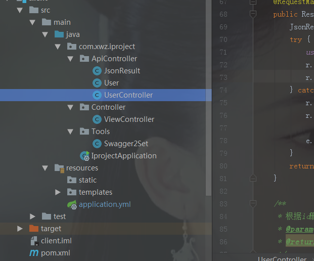

# spring boot项目整合swagger2  

## 背景  
* 通常同学们采用统一编写word接口文档，但有时在不完善的情况下，几个痛点会让人无语：
  * 接口文档规范问题  
  * 文档需要实时更新  
  * 接口文档太多，不好管理  
* 基于痛点，我们可以采用自动生成文档模式：swagger2、RAP等

## 简介  
* 代码侵入式注解自动生成api文档（swagger-ui）。(RAP是在线手动填写关键信息，生成api文档,优劣各有) 
* 读者可以通过本文章了解并成功操作spring boot整合swagger2，并生成api文档，在线查阅  
* 如图效果：
  * 整体预览：  
      
  * api详情：  
      

## pom文件添加依赖  
```
    <dependency>
    <groupId>io.springfox</groupId>
    <artifactId>springfox-swagger2</artifactId>
    <version>2.6.1</version>
    </dependency>
    
    <dependency>
    <groupId>io.springfox</groupId>
    <artifactId>springfox-swagger-ui</artifactId>
    <version>2.6.1</version>
    </dependency>
```  
## 下载swagger插件  
*   
## Swagger配置类  
* 配置了api文件也就是controller包的路径,扫描到controller类里的接口  
  * 用@Configuration注解该类  
  * 例：
  ```java  
    package com.xwz.iproject.Tools;


    import org.springframework.beans.factory.annotation.Value;
    import org.springframework.context.annotation.Bean;
    import org.springframework.context.annotation.Configuration;
    import springfox.documentation.builders.ApiInfoBuilder;
    import springfox.documentation.builders.PathSelectors;
    import springfox.documentation.builders.RequestHandlerSelectors;
    import springfox.documentation.service.ApiInfo;
    import springfox.documentation.spi.DocumentationType;
    import springfox.documentation.spring.web.plugins.Docket;

    @Configuration
    public class Swagger2Set {
        @Value("${swagger.enable}")
        private boolean enableSwagger;

        @Bean
        public Docket createRestApi() {
            return new Docket(DocumentationType.SWAGGER_2)
                    .apiInfo(apiInfo())
                    .enable(enableSwagger)
                    .select()
                    .apis(RequestHandlerSelectors.basePackage("com.xwz.iproject.ApiController"))
                    .paths(PathSelectors.any())
                    .build();
        }

        private ApiInfo apiInfo() {
            return new ApiInfoBuilder()
                    .title("springboot利用swagger构建api文档")
                    .description("简单优雅的restfun风格，https://blog.csdn.net/qq_31424825")
                    .termsOfServiceUrl("https://blog.csdn.net/qq_31424825")
                    .version("1.0")
                    .build();
        }

    }
    ``` 
## 开启Swagger  
* 在启动类上添加``@EnableSwagger2``注解，开启swagger   
  * 例：
    ```java   
        package com.xwz.iproject;
        import org.springframework.boot.SpringApplication;
        import org.springframework.boot.autoconfigure.SpringBootApplication;
        import springfox.documentation.swagger2.annotations.EnableSwagger2;

        @SpringBootApplication
        @EnableSwagger2
        public class IprojectApplication {

            public static void main(String[] args) {
                SpringApplication.run(IprojectApplication.class, args);
            }
        }

    ```  

## 编写ApiController：RESTFUL接口  
  * 新建Json格式输出类  
    例： 
    ```java 
       package com.xwz.iproject.ApiController;
        public class JsonResult {
            public String getStatus() {
                return status;
            }

            public void setStatus(String status) {
                this.status = status;
            }

            public Object getResult() {
                return result;
            }

            public void setResult(Object result) {
                this.result = result;
            }

            private String status = null;
            private Object result = null;

        }

    ```  
  * 新建实体User.class  
    例：
    ```java  
      package com.xwz.iproject.ApiController;

        import java.util.Date;

        public class User {

            public int getId() {
                return id;
            }

            public void setId(int id) {
                this.id = id;
            }

            public String getUsername() {
                return username;
            }

            public void setUsername(String username) {
                this.username = username;
            }

            public int getAge() {
                return age;
            }

            public void setAge(int age) {
                this.age = age;
            }

            public Date getCtm() {
                return ctm;
            }

            public void setCtm(Date ctm) {
                this.ctm = ctm;
            }

            private int id;
            private String username;
            private int age;
            private Date ctm;

        }

    ```  
  * 新建UserControllerl类：
     * 这里是spring boot restful接口风格，引用swagger注解:``@ApiOperation``、``@ApiImplicitParam``等  
     例：
      ```java 
        package com.xwz.iproject.ApiController;

            import io.swagger.annotations.ApiImplicitParam;
            import io.swagger.annotations.ApiImplicitParams;
            import io.swagger.annotations.ApiOperation;
            import org.springframework.http.ResponseEntity;
            import org.springframework.web.bind.annotation.*;
            import springfox.documentation.annotations.ApiIgnore;

            import java.util.*;

            @RestController
            public class UserController {

                /** 创建线程安全的Map*/
                static Map<Integer, User> users = Collections.synchronizedMap(new HashMap<Integer, User>());

                /**
                * 根据ID查询用户
                * @param id
                * @return
                */
                @ApiOperation(value="获取用户详细信息", notes="根据url的id来获取用户详细信息")
                @ApiImplicitParam(name = "id", value = "用户ID", required = true, dataType = "Integer", paramType = "path")
                @RequestMapping(value = "user/{id}", method = RequestMethod.GET)
                public ResponseEntity<JsonResult> getUserById (@PathVariable(value = "id") Integer id){
                    JsonResult r = new JsonResult();
                    try {
                        User user = users.get(id);
                        r.setResult(user);
                        r.setStatus("ok");
                    } catch (Exception e) {
                        r.setResult(e.getClass().getName() + ":" + e.getMessage());
                        r.setStatus("error");
                        e.printStackTrace();
                    }
                    return ResponseEntity.ok(r);
                }

                /**
                * 查询用户列表
                * @return
                */
                @ApiOperation(value="获取用户列表", notes="获取用户列表")
                @RequestMapping(value = "users", method = RequestMethod.GET)
                public ResponseEntity<JsonResult> getUserList (){
                    JsonResult r = new JsonResult();
                    try {
                        List<User> userList = new ArrayList<User>(users.values());
                        r.setResult(userList);
                        r.setStatus("ok");
                    } catch (Exception e) {
                        r.setResult(e.getClass().getName() + ":" + e.getMessage());
                        r.setStatus("error");
                        e.printStackTrace();
                    }
                    return ResponseEntity.ok(r);
                }

                /**
                * 添加用户
                * @param user
                * @return
                */
                @ApiOperation(value="创建用户", notes="根据User对象创建用户")
                @ApiImplicitParam(name = "user", value = "用户详细实体user", required = true, dataType = "User")
                @RequestMapping(value = "user", method = RequestMethod.POST)
                public ResponseEntity<JsonResult> add (@RequestBody User user){
                    JsonResult r = new JsonResult();
                    try {
                        users.put(user.getId(), user);
                        r.setResult(user.getId());
                        r.setStatus("ok");
                    } catch (Exception e) {
                        r.setResult(e.getClass().getName() + ":" + e.getMessage());
                        r.setStatus("error");

                        e.printStackTrace();
                    }
                    return ResponseEntity.ok(r);
                }

                /**
                * 根据id删除用户
                * @param id
                * @return
                */
                @ApiOperation(value="删除用户", notes="根据url的id来指定删除用户")
                @ApiImplicitParam(name = "id", value = "用户ID", required = true, dataType = "Long", paramType = "path")
                @RequestMapping(value = "user/{id}", method = RequestMethod.DELETE)
                public ResponseEntity<JsonResult> delete (@PathVariable(value = "id") Integer id){
                    JsonResult r = new JsonResult();
                    try {
                        users.remove(id);
                        r.setResult(id);
                        r.setStatus("ok");
                    } catch (Exception e) {
                        r.setResult(e.getClass().getName() + ":" + e.getMessage());
                        r.setStatus("error");

                        e.printStackTrace();
                    }
                    return ResponseEntity.ok(r);
                }

                /**
                * 根据id修改用户信息
                * @param user
                * @return
                */
                @ApiOperation(value="更新信息", notes="根据url的id来指定更新用户信息")
                @ApiImplicitParams({
                        @ApiImplicitParam(name = "id", value = "用户ID", required = true, dataType = "Long",paramType = "path"),
                        @ApiImplicitParam(name = "user", value = "用户实体user", required = true, dataType = "User")
                })
                @RequestMapping(value = "user/{id}", method = RequestMethod.PUT)
                public ResponseEntity<JsonResult> update (@PathVariable("id") Integer id, @RequestBody User user){
                    JsonResult r = new JsonResult();
                    try {
                        User u = users.get(id);
                        u.setUsername(user.getUsername());
                        u.setAge(user.getAge());
                        users.put(id, u);
                        r.setResult(u);
                        r.setStatus("ok");
                    } catch (Exception e) {
                        r.setResult(e.getClass().getName() + ":" + e.getMessage());
                        r.setStatus("error");

                        e.printStackTrace();
                    }
                    return ResponseEntity.ok(r);
                }

                @ApiIgnore//使用该注解忽略这个API
                @RequestMapping(value = "/hi", method = RequestMethod.GET)
                public String  jsonTest() {
                    return " hi you!";
                }

            }

      ```  
## swagger2注解介绍：  
* swagger通过注解表明该接口会生成文档，包括接口名、请求方法、参数、返回信息的等等，如：  
  * @ApiIgnore：使用注解忽略该API，不会参与文档生成  
  * @ApiOperation：描述该api,如： @ApiOperation(value="创建用户", notes="根据User对象创建用户")  
  * 请求方法：@RequestMapping(value = "user", method = RequestMethod.POST)  
  * 参数x信息：@ApiImplicitParam(name = "user", value = "用户详细实体user", required = true, dataType = "User")  
  * @Api：修饰整个类，描述Controller的作用  
  * @ApiParam：单个参数描述  
  * @ApiModel：用对象来接收参数  
  * @ApiResponses：HTTP响应整体描述  
  * @ApiProperty：用对象接收参数时，描述对象的一个字段  
## 项目截图  
     
## 启动项目，查看swagger-ui文档    
* 启动SpringBoot项目，访问 http://localhost:8950/swagger-ui.html（8950是项目端口），如果成功，将出现前文预览详情截图  
## 关闭swagger-ui文档  
* 这是在开发模式下，当我们项目发布后，我们还需要关闭swagger文档  
  * 添加yml文件配置： 
    ```
      swagger:
        enable: true
    ```  
  * 在``Swagger2Set``类中读取配置：  
    例：  
      
