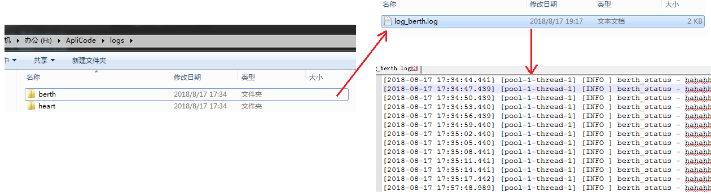

# 关于logback
# 配置文件示例
```
<?xml version="1.0" encoding="UTF-8"?>
<configuration>

    <include resource="org/springframework/boot/logging/logback/defaults.xml"/>
    <include resource="org/springframework/boot/logging/logback/console-appender.xml"/>

    <!--定义日志文件的存储地址 勿在 LogBack 的配置中使用相对路径-->
    <property name="LOG_PATH" value="H:\\ApliCode\\logs"/>
    <!--设置系统日志目录-->
    <property name="HEART_LOGDIR" value="heart"/>
    <property name="BERTH_LOGDIR" value="berth"/>

    <!--输出策略：输出日志到控制台的策略 -->
    <appender name="STDOUT" class="ch.qos.logback.core.ConsoleAppender">
        <encoder>
            <pattern>%d{yyyy-MM-dd HH:mm:ss} [%class:%line] %-5level - %msg%n</pattern>
            <charset>UTF-8</charset>
        </encoder>
    </appender>


    <!--输出策略：输出日志到文件的策略-->
    <!--【心跳日志】-->
    <appender name="HEART_FILE" class="ch.qos.logback.core.rolling.RollingFileAppender">
        <!-- 正在记录的日志文件的路径及文件名 -->
        <file>${LOG_PATH}/${HEART_LOGDIR}/log_heart.log</file>
        <!-- 级别过滤器，只打印info级别的日志 -->
        <filter class="ch.qos.logback.classic.filter.LevelFilter">
            <level>INFO</level>
            <onMatch>ACCEPT</onMatch>
            <onMismatch>DENY</onMismatch>
        </filter>
        <!--日志归档回滚策略：按照日期和大小-->
        <rollingPolicy class="ch.qos.logback.core.rolling.SizeAndTimeBasedRollingPolicy">
            <!--日志文件输出的文件名-->
            <!-- 按天回滚 daily -->
            <FileNamePattern>${LOG_PATH}/${HEART_LOGDIR}-%d{yyyy-MM-dd}.%i.log</FileNamePattern>
            <!--日志文件保留天数-->
            <MaxHistory>30</MaxHistory>
            <!--日志文件最大的大小-->
            <MaxFileSize>1024MB</MaxFileSize>
        </rollingPolicy>

        <!-- 日志文件的格式 -->
        <encoder class="ch.qos.logback.classic.encoder.PatternLayoutEncoder">
            <pattern>===%d{yyyy-MM-dd HH:mm:ss.SSS} %-5level %logger Line:%-3L - %msg%n</pattern>
            <charset>utf-8</charset>
        </encoder>

        <!--日志输出格式-->
        <encoder class="ch.qos.logback.classic.encoder.PatternLayoutEncoder">
            <!--格式化输出：%d表示日期，%thread表示线程名，%-5level：级别从左显示5个字符宽度%msg：日志消息，%n是换行符-->
            <pattern>[%d{yyyy-MM-dd HH:mm:ss.SSS}] [%thread] [%-5level] %logger{50} - %msg%n</pattern>
            <charset>UTF-8</charset>
        </encoder>
    </appender>

    <!-- 【状态日志】 -->
    <appender name="BERTH_FILE" class="ch.qos.logback.core.rolling.RollingFileAppender">
        <!-- 正在记录的日志文件的路径及文件名 -->
        <file>${LOG_PATH}/${BERTH_LOGDIR}/log_berth.log</file>
        <!-- 级别过滤器，只打印info级别的日志 -->
        <filter class="ch.qos.logback.classic.filter.LevelFilter">
            <level>INFO</level>
            <onMatch>ACCEPT</onMatch>
            <onMismatch>DENY</onMismatch>
        </filter>
        <rollingPolicy class="ch.qos.logback.core.rolling.SizeAndTimeBasedRollingPolicy">
            <!--归档日志的格式-->
            <FileNamePattern>${LOG_PATH}/${BERTH_LOGDIR}-%d{yyyy-MM-dd}.%i.log</FileNamePattern>
            <!--日志文件保留天数-->
            <MaxHistory>30</MaxHistory>
            <!--日志文件最大的大小-->
            <MaxFileSize>1024MB</MaxFileSize>
        </rollingPolicy>

        <encoder class="ch.qos.logback.classic.encoder.PatternLayoutEncoder">
            <!--格式化输出：%d表示日期，%thread表示线程名，%-5level：级别从左显示5个字符宽度%msg：日志消息，%n是换行符-->
            <pattern>[%d{yyyy-MM-dd HH:mm:ss.SSS}] [%thread] [%-5level] %logger{50} - %msg%n</pattern>
            <charset>UTF-8</charset>
        </encoder>
    </appender>
    <--! 如果想要阻断层级间的继承可以为logger设置additivity="false"属性,不会向上继承-->
    <logger name="heartbeat_report" additivity="true">
        <appender-ref ref="HEART_FILE"/>
    </logger>
    <logger name="berth_status" additivity="true">
        <appender-ref ref="BERTH_FILE"/>
    </logger>

    <!-- 根节点日志：具体控制台或者文件对日志级别的处理还要看所在appender配置的filter，如果没有配置filter，则使用root配置 -->
    <root level="INFO">
        <appender-ref ref="STDOUT"/>
        <appender-ref ref="CONSOLE"/>
    </root>
</configuration>
```
# 日志使用

# 日志生成

