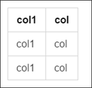

# Markdown基础命令 {ignore=true}


<!-- @import "[TOC]" {cmd="toc" depthFrom=1 depthTo=6 orderedList=false} -->
<!-- code_chunk_output -->

* [标题](#标题)
* [正文](#正文)
* [表格](#表格)
* [超链接](#超链接)
* [图片](#图片)
* [maimaid](#maimaid)

<!-- /code_chunk_output -->

## 标题
```
# 标题1
## 标题2
### 标题3
#### 标题4
##### 标题5
```
效果：


## 正文

* 普通正文，直接输入即可；
* 背景灰,`灰色背景示例`；
```
`灰色背景示例`
```
* 斜体,*斜体*；
```
*斜体*
```
* 强调,**强调**；
```
*强调*
```

## 表格

```
|col1|col|
|----|---|
|col1|col|
|col1|col|
```
效果如下图



## 超链接

格式：
```
[文字](url)
```
如：
```
[官网](https://www.baidu.com)
```
效果：
[官网](https://www.baidu.com)

## 图片
格式：
```
[alt](url_or_path)
```
如：
```
[alt](assets/2017-08-21-21-00-25.png)
```
效果：


## maimaid


