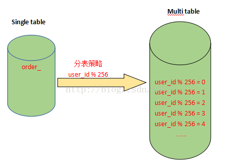

# 数据库分表分库
我们知道每台机器无论配置多么好它都有自身的物理上限，所以当我们应用已经能触及或远远超出单台机器的某个上限的时候，我们惟有寻找别的机器的帮助或者继续升级的我们的硬件，但常见的方案还是通过添加更多的机器来共同承担压力。

我们还得考虑当我们的业务逻辑不断增长，我们的机器能不能通过线性增长就能满足需求？因此，使用数据库的分库分表，能够立竿见影的提升系统的性能。

## 1.分表

* 什么是数据库分表（为什么要数据库分表）

对于大型的互联网应用来说，数据库单表的记录行数可能达到千万级甚至是亿级，并且数据库面临着极高的并发访问。采用Master-Slave复制模式的MySQL架构，只能够对数据库的读进行扩展，而对数据库的写入操作还是集中在Master上，并且单个Master挂载的Slave也不可能无限制多，Slave的数量受到Master能力和负载的限制。

因此，需要对数据库的吞吐能力进行进一步的扩展，以满足高并发访问与海量数据存储的需要！

对于访问极为频繁且数据量巨大的单表来说，我们首先要做的就是减少单表的记录条数，以便减少数据查询所需要的时间，提高数据库的吞吐，这就是所谓的分表！

在分表之前，首先需要选择适当的分表策略，使得数据能够较为均衡地分不到多张表中，并且不影响正常的查询！

## 2.分库

* 什么是分库（为什么要分库）

分表能够解决单表数据量过大带来的查询效率下降的问题，但是，却无法给数据库的并发处理能力带来质的提升。面对高并发的读写访问，当数据库master

服务器无法承载写操作压力时，不管如何扩展slave服务器，此时都没有意义了。

因此，我们必须换一种思路，对数据库进行拆分，从而提高数据库写入能力，这就是所谓的分库!

与分表策略相似，分库可以采用通过一个关键字取模的方式，来对数据访问进行路由，如下图所示：

## 3.分库分表

有时数据库可能既面临着高并发访问的压力，又需要面对海量数据的存储问题，这时需要对数据库既采用分表策略，又采用分库策略，以便同时扩展系统的并发处理能力，以及提升单表的查询性能，这就是所谓的分库分表。

分库分表的策略比前面的仅分库或者仅分表的策略要更为复杂，一种分库分表的路由策略如下：
1. 中间变量 = user_id % (分库数量 * 每个库的表数量)
2. 库 = 取整数 (中间变量 / 每个库的表数量)
3. 表 = 中间变量 % 每个库的表数量

同样采用user_id作为路由字段，首先使用user_id 对库数量*每个库表的数量取模，得到一个中间变量；然后使用中间变量除以每个库表的数量，取整，便得到对应的库；而中间变量对每个库表的数量取模，即得到对应的表。
分库分表策略详细过程如下：
假设将原来的单库单表order拆分成256个库，每个库包含1024个表，那么按照前面所提到的路由策略，对于user_id=262145 的访问，路由的计算过程如下：
1. 中间变量 = 262145 % (256 * 1024) = 1
2. 库 = 取整 (1/1024) = 0
3. 表 = 1 % 1024 = 1
这就意味着，对于user_id=262145 的订单记录的查询和修改，将被路由到第0个库的第1个order_1表中执行！！！

## 4.其他
* 常见分表分库策略
1. Range（范围）
2. Hash（哈希）
3. 按照时间拆分
4. Hash之后按照分表个数取模
5. 在认证库中保存数据库配置，就是建立一个DB，这个DB单独保存user_id到DB的映射关系

* 推荐博客：

https://blog.csdn.net/will5451/article/details/72617724

https://blog.csdn.net/xlgen157387/article/details/53976153

https://blog.csdn.net/xlgen157387/article/details/53230138