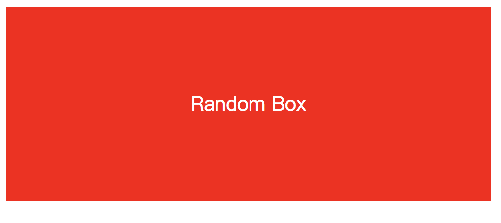

## 练习:random box

### 前言

生成一个div，包含一个字符串，该字符串的背景和字体大小随机。



### 代码


```html
  <div id="app">
  </div>
  <script type="text/babel">
  class RandomBox extends React.Component{
    render(){
      const fontSize = Math.floor(Math.random() * 80) + 20;
      const backgroundColor = ['red','green','blue','black'][Math.floor(Math.random()*4)];
      return (
        <div  style={{
          display: 'flex',
          alignItems: 'center',
          justifyContent: 'center',
          backgroundColor,
          fontSize: `${fontSize}px`,
          height: '200px',
          width: '500px',
          color: 'white'
        }}>
          Random Box
        </div>
      );
    }
  }
  ReactDOM.render(<RandomBox />, document.getElementById("app"));
  </script>
```

关键代码如上所示：  
* ReactDOM关联组建和div.
* fontSize变量传递给插件``fontSize: `${fontSize}px`,``注意是`` ` ``符号；
* backgroundColor变量传递给backgroundColor，采用了简写的方式,实际写成``backgroundColor: `${backgroundColor}`,``也可以；

