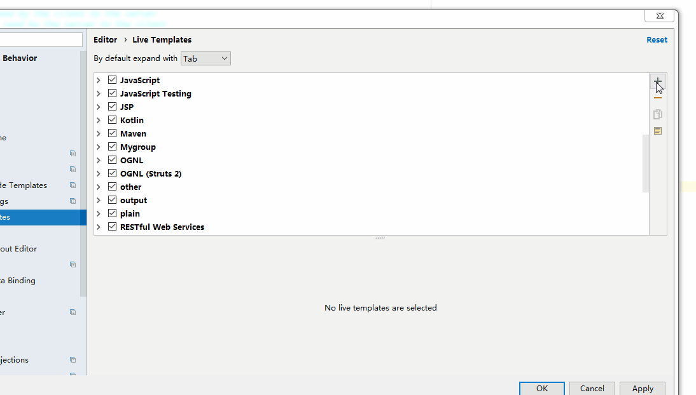
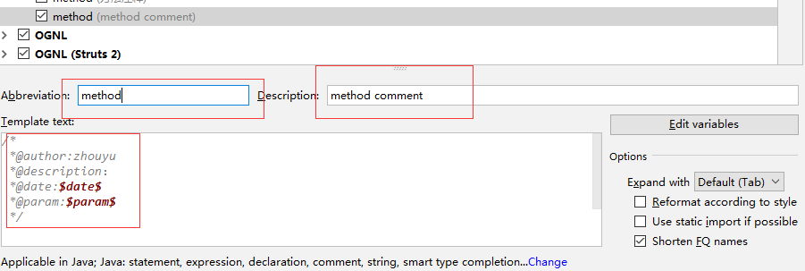

# idea

## 插件

* jrebel,热部署
* lombok,自动生成get 和set并且不用在代码中显示；
* idea 自定义类和方法的注释
  * 效果演示

    

  * 设置步骤1:ctrl+alt+s-->live Template-->绿色的加号-->TemlateGoup
  
    

  * 设置步骤2：添加Group
    
     

  * 设置步骤3：向Group添加自定义的模板,然后点击Edit Variables

    
    

  * 设置步骤4：编辑注释的变量表达式，给注释的字面量赋予特定的含义，如date表示日期

    

## [IDEA打开多个项目](ideaOpenpro.md)