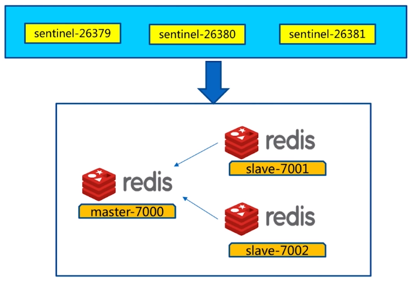

# redis高可用sentinel安装

## 前言

本文介绍redis高可用哨兵模式的部署方法。 在开始本文之前，服务器需要已经安装好redis软件。 如果还未安装好，则请参考[redis安装](./install.md)


本文部署软件架构如下：



* 1主，2从，3哨兵的模式。 
* 压实部署的时候都部署在一台电脑上，在生产服务器上，需要分开部署才能保证高可用性；

## 部署

### 配置开启主从节点；

* 创建文件夹``mkdir  /opt/soft/redis/data`` ``mkdir -p /var/log/redis/``
* 在redis安装包下面找到redis.conf文件，复制出三个文件，作为主从节点的配置文件``redis-7000.conf``,``redis-7001.conf``,``redis-7002.conf``；

* 修改配置文件``redis-7000.conf``
    ```
    port 7000
    daemonize yes
    pidfile /var/run/redis-7000.pid
    logfile "7000.log"
    dir /opt/soft/redis/data/
    ```

* 修改配置文件``redis-7001.conf``
    ```
    port 7001
    daemonize yes
    pidfile /var/run/redis-7001.pid
    logfile "7001.log"
    dir /opt/soft/redis/data/
    slaveof 127.0.0.1 7000
    ```

* 修改配置文件``redis-7002.conf``
    ```
    port 7002
    daemonize yes
    pidfile /var/run/redis-7002.pid
    logfile "7002.log"
    dir /opt/soft/redis/data/
    slaveof 127.0.0.1 7000
    ```

* 启动三个节点    
    ````
    redis-server redis-7000.conf
    redis-server redis-7001.conf
    redis-server redis-7002.conf
    ````

* 验证主从节点是否安装好   
    ```shell
    [root@bogon conf]# redis-cli -p 7000 info replication
    # Replication
    role:master
    connected_slaves:2
    slave0:ip=127.0.0.1,port=7001,state=online,offset=98,lag=0
    slave1:ip=127.0.0.1,port=7002,state=online,offset=98,lag=0
    master_replid:b891df80a8b879c7ca8385b91721d3df0da76b25
    master_replid2:0000000000000000000000000000000000000000
    master_repl_offset:98
    second_repl_offset:-1
    repl_backlog_active:1
    repl_backlog_size:1048576
    repl_backlog_first_byte_offset:1
    repl_backlog_histlen:98
    ```

### 配置开启sentinel控制节点（sentinel是特殊的redis）

* 在redis安装包下面找到sentinel.conf文件，复制出文件``redis-sentinel-26379.conf``  
* 修改文件``vim redis-sentinel-26379.conf``    
    ```
    port 26379
    protected-mode no
    daemonize yes
    dir /opt/soft/redis/data
    logfile "26379.log"
    sentinel monitor mymaster 127.0.0.1 7000 2
    sentinel down-after-milliseconds mymaster 30000
    sentinel parallel-syncs mymaster 1
    sentinel failover-timeout mymaster 180000
    ```

* 新建另外2个哨兵配置文件
    ```
    sed "s/26379/26380/g" redis-sentinel-26379.conf > redis-sentinel-26380.conf
    sed "s/26379/26381/g" redis-sentinel-26379.conf > redis-sentinel-26381.conf
    ```

* 删除2个新的配置文件，以下一行``sentinel myid 32bdc836a3f3b4a45b0e6ee0e7b209648109ec32``
    ```
    sed -i '/^sentinel myid.*/d' redis-sentinel-26380.conf
    sed -i '/^sentinel myid.*/d' redis-sentinel-26381.conf
    ```

* 启动哨兵节点
    ```
    redis-sentinel redis-sentinel-26379.conf
    redis-sentinel redis-sentinel-26381.conf 
    redis-sentinel redis-sentinel-26381.conf 
    ```

* 验证哨兵节点是否安装好，如下最后一句可以看到:有2个从节点，3个sentinels，安装完成
    ```
    [root@bogon conf]# redis-cli -p 26381 ping
    PONG
    [root@bogon conf]# redis-cli -p 26381 info sentinel
    # Sentinel
    sentinel_masters:1
    sentinel_tilt:0
    sentinel_running_scripts:0
    sentinel_scripts_queue_length:0
    sentinel_simulate_failure_flags:0
    master0:name=mymaster,status=ok,address=127.0.0.1:7000,slaves=2,sentinels=3
    ```

* 如果redis需要除了本机以外的其他端口访问，则需要打开相应端口（7000,7001,7002,26379,26380,26381），打开对应端口访问方法请参考[linux防火墙](/Linux/content/iptables.md)

## 补充说明

[配置文件](../redis.zip)