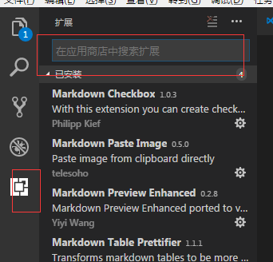
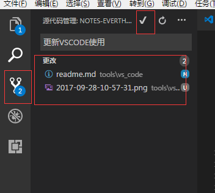
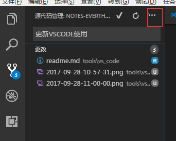

# VS CODE

## 安装文件
去[官网](https://code.visualstudio.com/)下载最新文件

## 安装插件

* 管理员打开VS CODE

* 搜索安装以下插件
    * markdown checkbox
    * markdown pase image
    * markdown preview enhanced
    * markdown table prettifier  
    

## 提交git

* 查看提交文件，添加注释，点击√提交   
    
* 点击三个点，点``推送``文件到服务器  
    

## 常用快捷键

| 快捷键        | 作用             |
|---------------|------------------|
| ctrl+,        | 打开用户设置     |
| ctrl+`        | 打开控制台命令   |
| ctrl+p        | 查找文件         |
| ctrl+shift+p  | 执行命令         |
| ctrl+shift+m  | 预览markdown文件 |
| ctrl+k,ctrl+s | 设置快捷键       |
