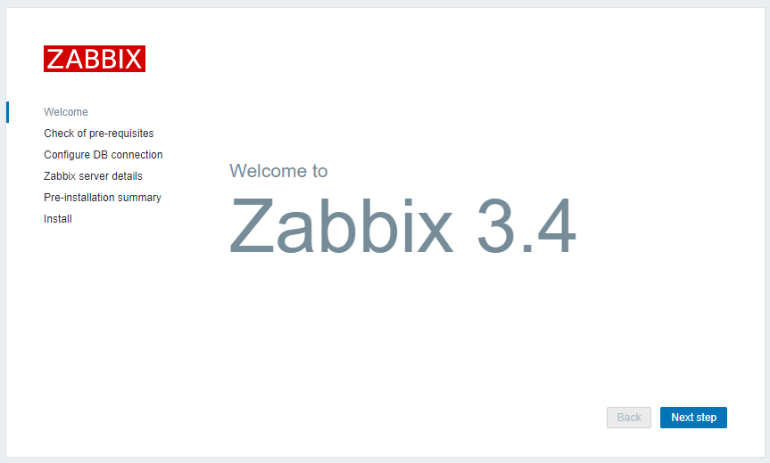
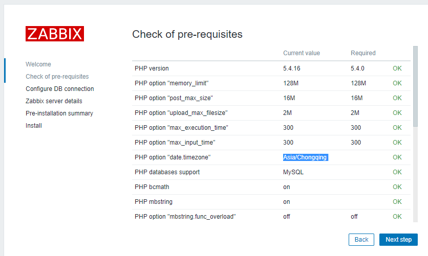
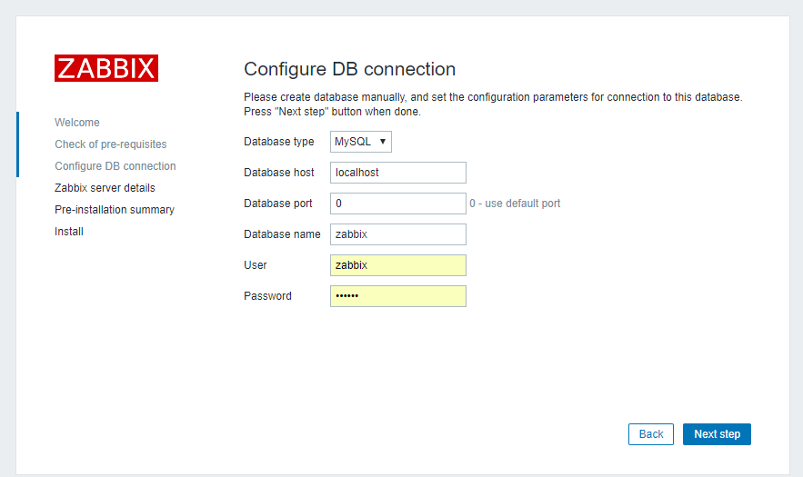
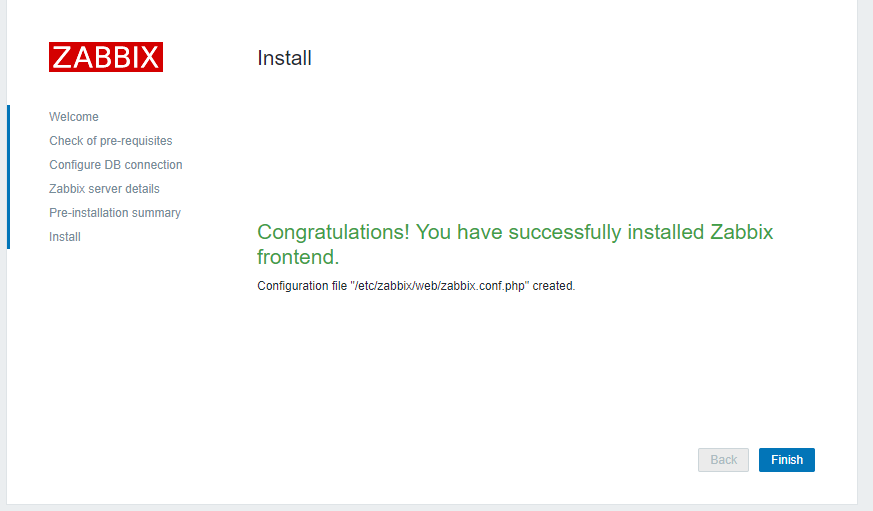
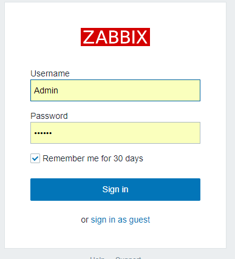

# zabbix 安装 {ignore=true}


<!-- @import "[TOC]" {cmd="toc" depthFrom=1 depthTo=6 orderedList=false} -->
<!-- code_chunk_output -->

* [前言](#前言)
* [安装server](#安装server)
	* [安装系统](#安装系统)
	* [安装仓库配置包](#安装仓库配置包)
	* [server安装](#server安装)
	* [安装数据库](#安装数据库)
	* [selinux配置](#selinux配置)
	* [启动zabbix](#启动zabbix)
	* [zabbix前端参数配置](#zabbix前端参数配置)
	* [启动http服务](#启动http服务)
	* [允许http端口访问](#允许http端口访问)
	* [用网页访问zabbix](#用网页访问zabbix)
* [配置zabbix-server前端](#配置zabbix-server前端)
* [安装zabbix-agent](#安装zabbix-agent)
	* [安装仓库配置包](#安装仓库配置包-1)
	* [安装软件](#安装软件)
	* [配置zabbix-agent](#配置zabbix-agent)
	* [启动](#启动)
	* [设置开机启动](#设置开机启动)
		* [CENTOS 6](#centos-6)
		* [centos 7](#centos-7)

<!-- /code_chunk_output -->


## 前言

zabbix安装有很多方法，如源码安装、包安装、容器安装，本文介绍centos 7下的包安装方法；如读者需要了解其他安装方法请阅读：https://www.zabbix.com/documentation/3.4/manual/installation。  
zabbix安装包括两个部分，zabbix-server安装,zabbix-agent安装；


## 安装server

### 安装系统

下载最小版centos 7,安装系统，本文不详细介绍系统安装

### 安装仓库配置包

```
# rpm -ivh http://repo.zabbix.com/zabbix/3.4/rhel/7/x86_64/zabbix-release-3.4-1.el7.centos.noarch.rpm
```


### server安装

```
# yum install zabbix-server-mysql zabbix-web-mysql
```

### 安装数据库


* 安装数据库方法请查看 [MYSQL安装](/mysql/install.md)，如果已经安装好，则直接执行下一步；

* 生成数据库
```
shell> mysql -uroot -p<password>
mysql> create database zabbix character set utf8 collate utf8_bin;
mysql> grant all privileges on zabbix.* to zabbix@localhost identified by '<password>';
mysql> quit;
```
注：``<password>``请根据自己实际情况填写；

* 导入初始化数据库
```
# zcat /usr/share/doc/zabbix-server-mysql-3.4.1/create.sql.gz | mysql -uzabbix -p zabbix
```
上诉脚本会需要我们输入密码才能够正常执行，并且请注意上面命令的版本``3.4.1``有可能不同，如果提示找不到文件，可以查看一下具体版本号，重新执行该命令； 

* 检查server是否正常安装
```
# rpm -q zabbix-server-mysql
```
* 配置数据库
根据实际情况，配置数据库
```
# vi /etc/zabbix/zabbix_server.conf
DBHost=localhost
DBName=zabbix
DBUser=zabbix
DBPassword=<password>
```
注： 上面几个配置并不连续，读者可以自行搜索几个配置项所在位置；

### selinux配置

关闭selinux
```
setenforce 0
```

### 启动zabbix 
```
# systemctl start zabbix-server
# systemctl enable zabbix-server
```

### zabbix前端参数配置

``vim /etc/httpd/conf.d/zabbix.conf``文件，读者可以自行修改；
```
php_value max_execution_time 300
php_value memory_limit 128M
php_value post_max_size 16M
php_value upload_max_filesize 2M
php_value max_input_time 300
php_value always_populate_raw_post_data -1
php_value date.timezone Asia/Chongqing
```
注意：默认的timezone需要根据实际情况设置

### 启动http服务

```
# systemctl start httpd
# systemctl enable httpd
```

### 允许http端口访问

打开端口
```
firewall-cmd --zone=public --add-port=80/tcp --permanent
```
* zone #作用域
* add-port=80/tcp  #添加端口，格式为：端口/通讯协议
* permanent  #永久生效，没有此参数重启后失效

重启防火墙
```
firewall-cmd --reload
```

### 用网页访问zabbix
在浏览器中输入地址``http://{ip_address}/zabbix``,访问zabbix主页，如果能打开则安装成功。


## 配置zabbix-server前端

* 打开网站``http://{ip_address}/zabbix``


* 检查网站安装需求；（如果有失败，可修改``/etc/httpd/conf.d/zabbix.conf``）


* 配置数据库  


* 配置监听端口、域名、服务器名字  


* 检查配置汇总  


* 安装完成  

后续如果需要修改配置，可以到``/etc/zabbix/web/zabbix.conf.php``上修改。

* 登录系统



默认用户：Admin
默认密码：zabbix


## 安装zabbix-agent

安装zabbix-agent安装在被安装电脑上
### 安装仓库配置包
centos 7
```
rpm -ivh http://repo.zabbix.com/zabbix/3.4/rhel/7/x86_64/zabbix-release-3.4-1.el7.centos.noarch.rpm
```
centos 6
```
# rpm -ivh http://repo.zabbix.com/zabbix/3.4/rhel/6/x86_64/zabbix-release-3.4-1.el6.noarch.rpm
```

### 安装软件
```
# yum install zabbix-agent
```

### 配置zabbix-agent

编辑配置文件``/etc/zabbix/zabbix_agentd.conf``

```
#Server=[zabbix server ip]
#Hostname=[ Hostname of client system ]

Server=192.168.1.11
Hostname=Server1
```
注：
1.服务器上使用命令‘hostname’查看hostname信息

2.IP地址根据实际配置。

### 启动

``/etc/init.d/zabbix-agent restart`` 重启zabbix  
``/etc/init.d/zabbix-agent start``   启动zabbix
``/etc/init.d/zabbix-agent stop``    停止zabbix


### 设置开机启动

####  CENTOS 6
```
chkconfig --level 235 zabbix-agent on
```
说明： 
chkconfig 功能说明：检查，设置系统的各种服务。
语法：chkconfig [--add][--del][--list][系统服务] 或 chkconfig [--level <等级代号>][系统服务][on/off/reset]
--add 添加服务
--del 删除服务
--list 查看各服务启动状态

Linux OS 将操作 环境分为以下7个等级(level)，即  
0：关机  
1：单用户模式（单用户、无网络）  
2：无网络支持的多用户模式（多用户、无网络）  
3：有网络支持的多用户模式（多用户、有网络）  
4：保留，未使用  
5：有网络支持有X-Window支持的多用户模式（多用户、有网络、X-Window界面）  
6：重新引导系统，即重启  

#### centos 7

```
# systemctl enable zabbix-agent
```