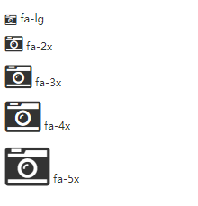
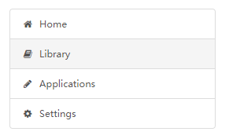

# font awesome


## 加载

* 下载 :http://fontawesome.dashgame.com/
* 复制整个 font-awesome 文件夹到您的项目中。
* 在HTML的 <head> 中引用font-awesome.min.css。

```html
<link rel="stylesheet" href="path/to/font-awesome/css/font-awesome.min.css">
```

## 使用
 
* 基本图标  


```html
<i class="fa fa-camera-retro"></i> fa-camera-retro
```

* 大图标



```html
<i class="fa fa-camera-retro fa-lg"></i> fa-lg
<i class="fa fa-camera-retro fa-2x"></i> fa-2x
<i class="fa fa-camera-retro fa-3x"></i> fa-3x
<i class="fa fa-camera-retro fa-4x"></i> fa-4x
<i class="fa fa-camera-retro fa-5x"></i> fa-5x     
```

* 固定宽度：

 

```html
<div class="list-group">
  <a class="list-group-item" href="#"><i class="fa fa-home fa-fw"></i>&nbsp; Home</a>
  <a class="list-group-item" href="#"><i class="fa fa-book fa-fw"></i>&nbsp; Library</a>
  <a class="list-group-item" href="#"><i class="fa fa-pencil fa-fw"></i>&nbsp; Applications</a>
  <a class="list-group-item" href="#"><i class="fa fa-cog fa-fw"></i>&nbsp; Settings</a>
</div>
```

* 列表：

  

```html
<ul class="fa-ul">
  <li><i class="fa-li fa fa-check-square"></i>List icons</li>
  <li><i class="fa-li fa fa-check-square"></i>can be used</li>
  <li><i class="fa-li fa fa-spinner fa-spin"></i>as bullets</li>
  <li><i class="fa-li fa fa-square"></i>in lists</li>
</ul>
```


* 更多使用方法：http://fontawesome.dashgame.com/#basic 
