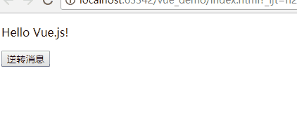

# 用户输入

## 代码

```
<!DOCTYPE html>
<html lang="en">
<head>
    <meta charset="UTF-8">
    <title>Title</title>
    <script src="https://unpkg.com/vue"></script>
</head>
<body>
<div id="app-5">
    <p>{{ message }}</p>
    <button v-on:click="reverseMessage">逆转消息</button>
</div>
<script>
    var app5 = new Vue({
        el: '#app-5',
        data: {
            message: 'Hello Vue.js!'
        },
        methods: {
            reverseMessage: function () {
                this.message = this.message.split('').reverse().join('')
            }
        }
    })
</script>
</body>
</html>
```

## 效果


## 说明

注意在 reverseMessage 方法中，我们更新了应用的状态，但没有触碰 DOM——所有的 DOM 操作都由 Vue 来处理，你编写的代码不需要关注底层逻辑。

